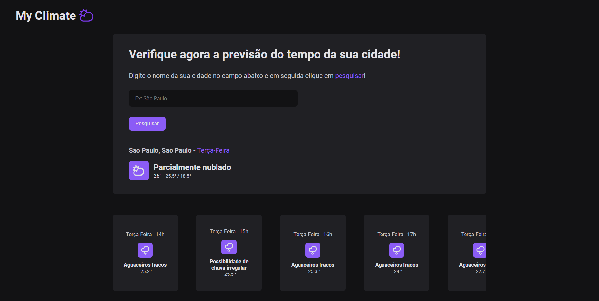

<h1 align="center"> My Climate </h1>

# Resumo do projeto

Aplicação de consulta dinâmica de clima de uma região utilizando NextJs, Typescript e WeatherAPI!

## 🔨 Funcionalidades do projeto

- `Funcionalidade 1` `Pesquisar cidade`: O usuário poderá pesquisar o nome de uma região / cidade para saber como está o clima atual na localidade pesquisada, e para isso é necessário apenas digitar o nome da cidade no campo sugerido

- `Funcionalidade 2` `Ver o clima durante o dia`: O usuário poderá conferir como estará o clima na região pesquisada até as 23h do dia atual.

## ✔️ Técnicas e tecnologias utilizadas

- `NextJS ⚛️`
- `Stiches 🎨`
- `Zod 🔐`
- `React-hook-form 📃`
- `Axios 🌐`
- `React-Toastify ⚠️`
- `Keen-slider 🎠`

## 📁 Acesso ao projeto

### Run

**Install dependencies**

```
npm install
```

**Run Dev**

```
npm run dev
```

Você pode acessar a aplicação clicando [aqui](https://thunderous-zabaione-02d5f0.netlify.app).
